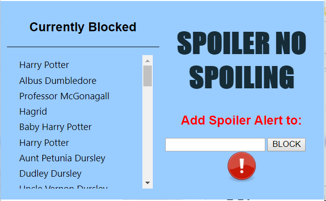

# QHacks 2019
## Chrome Extension Project : Spoilers No Spoiling!
###### By Brian Arthur, Jacob Laframboise, Catherine Wu, Emily Zhao

### Description
This extension prompts and accepts user input to prevent spoilers from appearing on webpages while on Chrome.

#### Installation
Download the qhacks folder. Go to "More Tools" --> "Extensions". Load unpacked and choose the qhacks folder.
Now in a new webpage, there should be an icon prompt which allows input of a movie name. After hitting [Enter], 
all instances of spoilers for that movie should be hidden from your internet adventures!

GUI: 

#### Structure
This project in primarily a google chrome extension written in Javascript and a little bit of CSS. 
It relies upon two custom Javascript API's which interact with movie database site. 

#### User Experience and Program Flow
1. The user opens their browser and clicks our extension.
2. They type in the name of the movie that they don't want spoiled. 
3. The Javascript makes a call to a custom API on stdlib based off of the nemo web scraper.
This API returns a link to a movie database site where more information on the movie can be found. 
4. This link is used in a call to a second custom API on stdlib, also based off of the nemo web scraper.
5. A list of characters in the movie is returned to the extension.
6. The extension blurs any paragraph that contains a character name in the movie or a key word you typed. 
7. The extension will automatically run on any new page that is loaded. 
